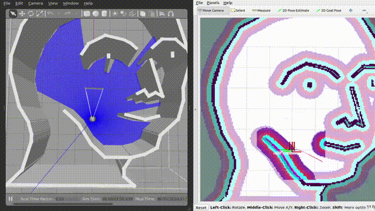

# Neuron APP: Inspection

# Support Platform:

* ADLINK Controller:
  - ROScube-I
  - ROScube-X
  - ROScube starterkit
* ROS version:
  - ROS 2 foxy

# Usage

1. Launch Navigation as well as Rviz with the Gazebo simulation. It will open with default mememan map.
    ```
    ros2 launch napp_inspection gazebo_inspection.launch.py
    ```
2. Launch Behavior Tree and camera snapshot. The robot will go through 3 checkpoint and take a photo at each point.
    ```
    ros2 launch napp_inspection bt_inspection_snapshot.launch.py
    ```
    
