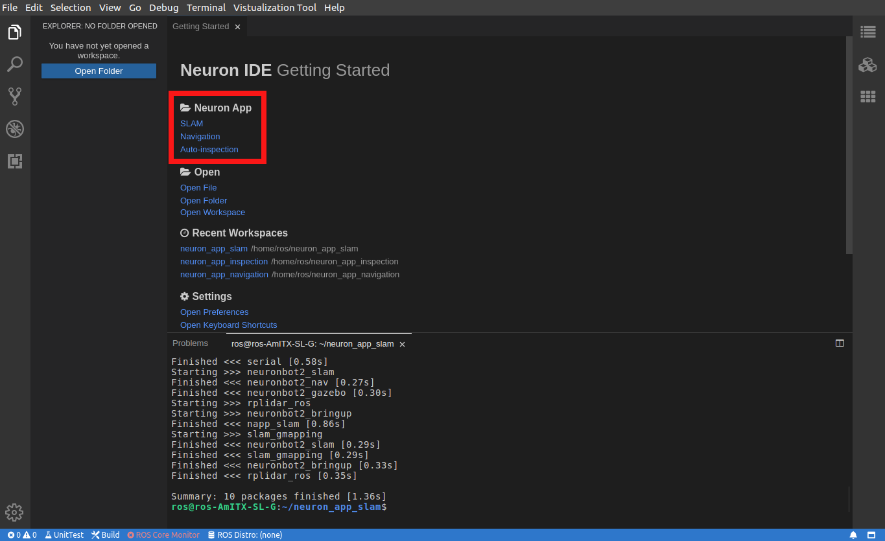

# Neuron APP: Inspection

# Support Platform:

* ADLINK Controller:
  - ROScube-I
  - ROScube-X
  - ROScube starterkit
* ROS version:
  - ROS 2 foxy

# Usage

## Quickstart

1. Click application in Neuron App to open workspace. **Click Auto-inspection.**  It will build the resource at first time it's opened.
     
   
2-1. Click "packages" on the right side.

2-2. Open list by click "RESOURCES" -> "user-workspace" -> "napp_inspction"
     
     

***NOTE!!! Following instruction would need : Right click desired launch file and click "Run" -> "Run Launch File" as image bellow***

   
     

3. Launch Navigation and image_saver as well as Rviz, choose **ONE**  file to launch: 

    * Simulation with Gazebo. It will open with default mememan map: **Launch gazebo_inspection.launch.py**

    * Deploy on Neuronbot2: **Launch neuronbot_inspection.launch.py**

4. Launch Behavior Tree and camera snapshot. **Launch bt_inspection_snapshot.launch.py**

    The robot will go through 3 checkpoint and take a photo at each point.

    
    
 ## Inspection on custom checkpoint

1. Launch Navigation 

    * Simulation with Gazebo: **Launch gazebo_inspection.launch.py**
    * Deploy on Neuronbot2: **Launch neuronbot_inspection.launch.py**

2. Set goal in Rviz2 and record position of robot.

    After robot reached the goal, open the list left side with double click.
   
   **TF -> Frames -> base_link -> positoin , orientation**
   
   Record X, Y in positoin and Z, W in orientation. Then you shall turn off Navigation.
   

4. Click "Explorer" on the left side.
5. Click "src" -> "BT_ros2" -> "bt_xml" -> "bt_nav_mememan_snapshot.xml"
6. Modify robot checkpoint at value in SetBlackboard.

   fill in the property with " X ; Y ; Z ; W " format
   

7. Follow step3 and 4 in quickstart.
