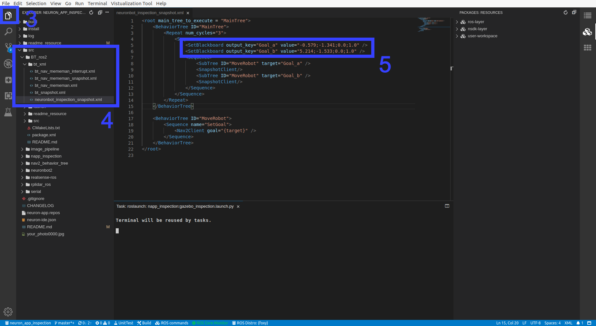

# Neuron APP: Inspection

# Support Platform:

* ADLINK Controller:
  - ROScube-I
  - ROScube-X
  - ROScube starterkit
* ROS version:
  - ROS 2 foxy

# Usage

## Quickstart

**Please enter workspace of Auto-inspection in Neuron IDE before you start Neuron App.**

***Note! If pictures is too small for your equipment. please click [Here](https://github.com/Adlink-ROS/neuron_app_inspection/blob/master/README.md) to open github page.***

1. Open "Packages:Resources" on the right side.

2. Open list by clicking "user-workspace" -> "napp_inspction"
     
     

***NOTE!!! Following instruction would need : Right click desired launch file and click "Run" -> "Run Launch File" as image bellow***

   
     

3. Launch Navigation and image_saver as well as Rviz, choose **ONE**  file to launch: 

    * Simulation with Gazebo. It will open with default mememan map: **Launch gazebo_inspection.launch.py in napp_inspection**
    
    **NOTE : Before you deploy inspection on Neuronbot2, you shall first complete [prerequisite](#Prerequisite-for-deploying-on-NeuronBot2), [SLAM](https://github.com/Adlink-ROS/neuron_app_slam) and [modify checkpoints](#inspection-on-custom-checkpoint).**

    * Deploy on Neuronbot2: **Launch neuronbot_inspection.launch.py in napp_inspection**

4. Launch Behavior Tree and camera snapshot. **Launch bt_inspection_snapshot.launch.py in napp_inspection**

    The robot will go through 2 checkpoint and take a photo at each point.
    
    The image files will be stored in workspace of neuron_app_inspection.
    
    
    
 ## Inspection on custom checkpoint

1. Launch Navigation 

    **NOTE: It will open with default map, please [modify launch file](https://github.com/Adlink-ROS/neuron_app_navigation#navigation-on-custom-map) if you want to navigate on custom map.**
    * Simulation with Gazebo: **Launch gazebo_inspection.launch.py in napp_inspection**
    * Deploy on Neuronbot2: **Launch neuronbot_inspection.launch.py in napp_inspection**

2. Set goal in Rviz2 and record position of robot.

    After robot reached the goal, open the list left side with double click.
   
   **TF -> Frames -> base_link -> position , orientation**
   
   Record X, Y in position and Z, W in orientation.
   


3. Open "Explorer" on the left side of Neuron IDE.

4. Open xml file.
    
    Click "src" -> "BT_ros2" -> "bt_xml" -> "neuronbot_inspection_snapshot.xml"

    
5. Modify robot checkpoint at value in SetBlackboard.

   fill in the property with " X ; Y ; Z ; W " format
   

   
   **NOTE: If you want to change xml file that launch file include, please modify file name in bt_inspection_snapshot.launch.py.**
   

6. Follow Step3 and Step4 in **[Quickstart](#Quickstart)**.

## Prerequisite for deploying on NeuronBot2

If you want to deploy auto-inspection with NeuronBot2 and Realsense, please follow instuction below.

1. Remove annotation of **realsense-ros** in **neuron-app.repos**
2. Install librealsense2 if you haven't installed before.

    ```bash
    sudo apt-key adv --keyserver keys.gnupg.net --recv-key F6E65AC044F831AC80A06380C8B3A55A6F3EFCDE || sudo apt-key adv --keyserver hkp://keyserver.ubuntu.com:80 --recv-key F6E65AC044F831AC80A06380C8B3A55A6F3EFCDE
    sudo add-apt-repository 'deb http://realsense-hw-public.s3.amazonaws.com/Debian/apt-repo focal main' -u
    sudo apt-get install librealsense2-dkms librealsense2-utils librealsense2-dev -y
    ````
3. Click **download sourse code** in **ROS commands**
4. Build packages in workspace

# Troubleshooting

If you face some problems while launching NeuronBot simulation, try to terminate the task and retry again.
There might be some processes still running and cause the issue.